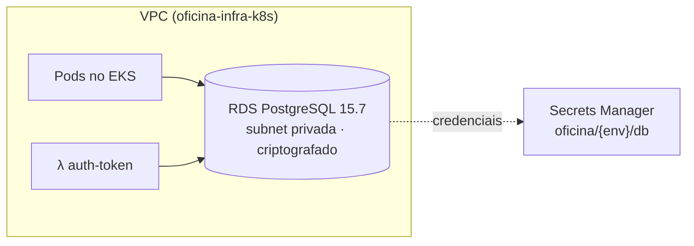

# oficina-infra-db

> Banco de dados gerenciado da oficina: **Amazon RDS PostgreSQL** em subnet privada, com credenciais no Secrets Manager. **Não** provisiona rede nem cluster — lê ambos do [oficina-infra-k8s](https://github.com/ProblemaTheu/oficina-infra-k8s) via SSM.

Parte do Tech Challenge — Fase 3. Repositórios irmãos: [oficina-app](https://github.com/ProblemaTheu/oficina-app) · [oficina-lambda-auth](https://github.com/ProblemaTheu/oficina-lambda-auth) · [oficina-infra-k8s](https://github.com/ProblemaTheu/oficina-infra-k8s)

## Papel na arquitetura



Porta 5432 aberta **apenas** para o security group dos nós do EKS e o das Lambdas. Sem acesso público.

## Tecnologias

| Tecnologia | Versão | Uso |
|---|---|---|
| Terraform | 1.15.7 | Provisionamento |
| Amazon RDS | PostgreSQL 15.7 | Banco gerenciado |
| AWS Secrets Manager | — | Credenciais (nunca no state nem em ConfigMap) |

## Execução

```bash
cd terraform && terraform init && terraform plan
```

Requer que o `oficina-infra-k8s` já tenha sido aplicado — a VPC, as subnets e os security groups vêm do SSM.

## Contrato com os outros repositórios

**Consome:** `/oficina/shared/vpc/id`, `/oficina/shared/vpc/subnets_privadas`, `/oficina/shared/eks/node_sg_id`, `/oficina/shared/lambda/sg_id`

**Publica:** `/oficina/{env}/db/endpoint`, `/oficina/{env}/db/secret_arn`

## Migrations

Rodam no **boot da aplicação** (golang-migrate com advisory lock do PostgreSQL), não neste repositório. O lock garante que apenas um pod aplique, mesmo com várias réplicas subindo juntas.

## Deploy

`.github/workflows/terraform.yml`:

| Evento | Role OIDC | O que faz |
|---|---|---|
| PR para `homolog` ou `main` | `gha-oficina-infra-db-plan` (só leitura) | `fmt`, `validate`, `plan` comentado no PR — **nunca aplica** |
| push na `main` / disparo manual | `gha-oficina-infra-db` | `plan` + `apply` do mesmo plan, no *environment* `prod` |

A role de PR não consegue criar, alterar nem destruir nada. Ela lê o state — e o state guarda a senha do RDS, o que vale para qualquer desenho de plan em PR; o que a separação protege é a infraestrutura. Roles definidas em `oficina-infra-k8s/bootstrap`.

`gitleaks` roda em todo evento. Sem `tfsec`/`checkov` (corte 15 do plano). A versão do Terraform do CI vem de `.terraform-version` e precisa ser a mesma da máquina que aplicou por último.

> ⚠️ Antes de qualquer migration destrutiva em produção: `aws rds create-db-snapshot`.

## Dockerfile

Não aplicável — este repositório não contém código executável.

## Documentação

Justificativa da escolha do banco, modelo ER e explicação dos relacionamentos em [oficina-app/docs](https://github.com/ProblemaTheu/oficina-app/tree/main/docs).
